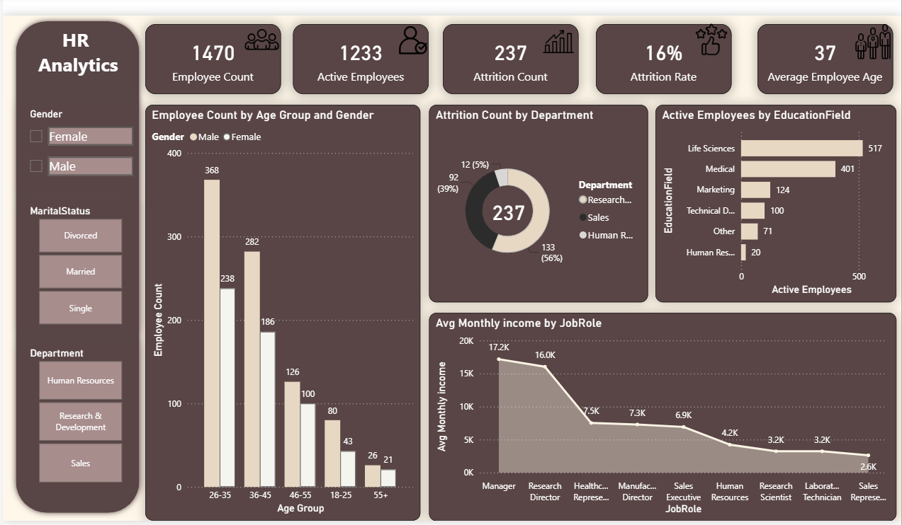

# HR-Analytics-Dashboard

Employee Attrition & Performance : Cleaned and transformed unstructured HR data using Power Query, 
establishing relational data models to ensure data integrity and interactive dashboard to analyze employee attrition and 
workforce performance. Created DAX measures and KPIs to deliver actionable HR insights. 
# 👥 HR Analytics Dashboard

## 📌 Project Overview

This project presents an interactive HR Analytics Dashboard developed using Power BI to analyze workforce data and employee attrition. The dashboard provides insights into employee demographics, department performance, salary distribution, job satisfaction, and attrition trends.

The project demonstrates how HR data can be transformed into meaningful visual insights that support strategic workforce planning and business decision-making.

---

# 🎯 Project Objectives

- Analyze employee attrition trends.
- Understand workforce demographics.
- Evaluate department-wise performance.
- Visualize salary and employee distribution.
- Build an interactive HR dashboard.

---

# 🛠️ Tools & Technologies

- Power BI
- Power Query
- DAX
- Excel

---

# 📂 Dataset Information

The dataset includes:

- Employee ID
- Gender
- Age
- Department
- Job Role
- Salary
- Education
- Attrition
- Job Satisfaction

---

# 🔄 Project Workflow

### Data Preparation
- Cleaned missing values.
- Removed duplicate records.
- Standardized data formats.

### Data Transformation
- Built data model.
- Created DAX measures.
- Designed interactive visuals.

### Dashboard Development
Created visualizations including:
- Employee Count
- Attrition Rate
- Department Analysis
- Gender Distribution
- Age Analysis
- Salary Analysis
- Job Satisfaction

---

# 📷 Dashboard Preview

---

# 💡 Key Insights

- Compared attrition across departments.
- Analyzed workforce demographics.
- Identified salary distribution patterns.
- Visualized employee satisfaction.

---

# 🚀 Skills Demonstrated

- Power BI
- DAX
- Power Query
- Data Visualization
- Dashboard Design
